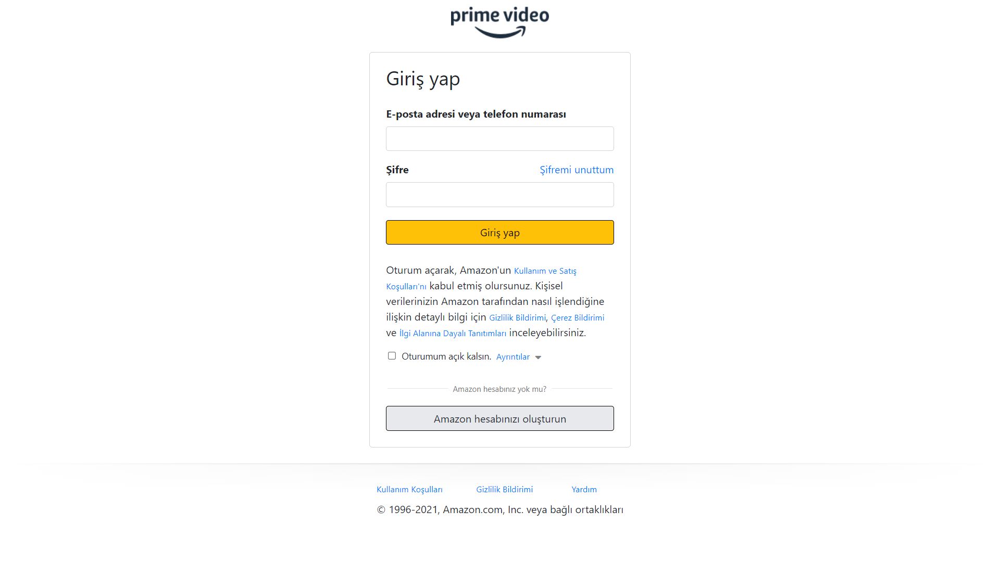
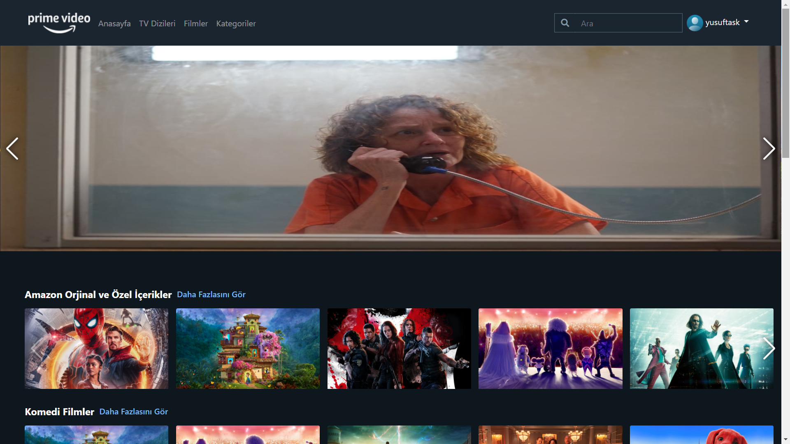
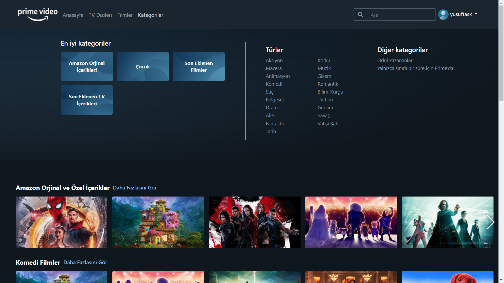
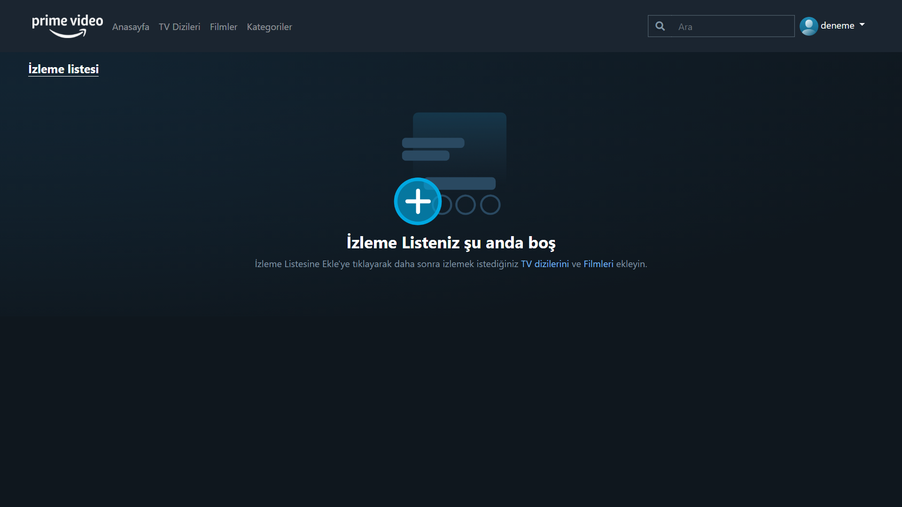
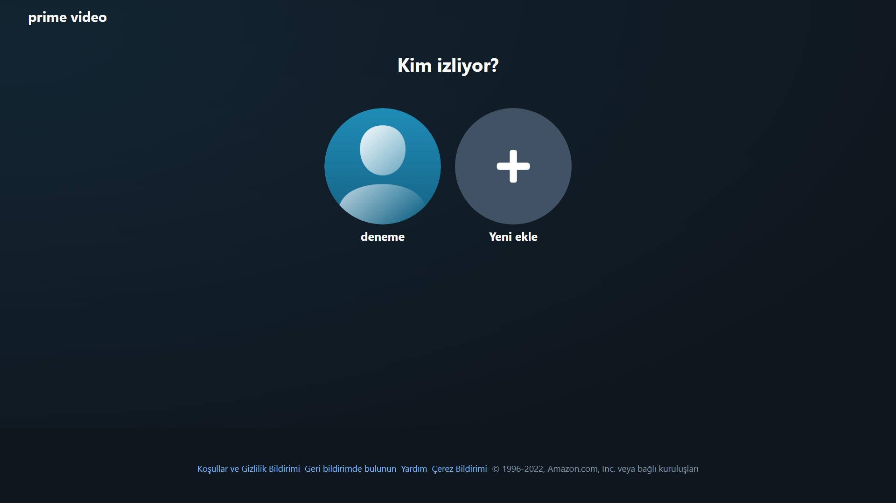
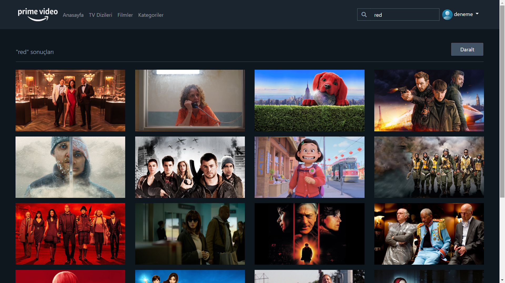

##  <h1 align="center">Vue.js-amazon-prime-video-clone </h1>
 <h4 align="center">Depo, gerçek hayatta milyonlarca aktif kullanıcısı olan uygulamanın klonunu içerir.</h4>
<h4 align="center">The repository contains the clone of the application with millions of active users in real life.</h4>
 
 
  
  
  

##  <h3 align="center">Projemi geliştirmeye devam etmekteyim bu süreçte yardımcı olmaktan çekinmeyin aşağıdaki adreslerden bana ulaşabilirsiniz.</h3>
##  <h3 align="center">I am continue to develop my project from different addresses below to assist me in this process.<a href="https://linkedin.com/in/www.linkedin.com/in/yusuftaskiran08" target="blank"></a></h3>


## Features
- Firabase Auth
- [x] Sign up
- [x] Sign in
- Movies or Tv
- [x] Movies
- [x] Search movies or tv
- [x] List of movies or tv by category
- [x] List of movies or tv with pagination
- [x] Detailed information or tv about the movie
- [x] Fully responsive movie or tv slider
- [x] Add movie or tv to "my list"

## Tech
- <a href="https://vuejs.org/"> Vue.js </a>
- <a href="https://github.com/vuejs/vuex#readme"> Vuex </a>
- <a href="https://mockapi.io/"> Mock api </a>
- <a href="https://firebase.google.com/"> Firabase </a>
- <a href="https://getbootstrap.com/"> Bootstrap </a>
- <a href="https://axios-http.com/"> Axios </a>
- <a href="https://github.com/anteriovieira/vue-youtube#readme"> Vue youtube </a>
- <a href="https://swiperjs.com/"> Swiper.Js </a>
- <a href="https://www.themoviedb.org/"> The movie db api </a>

## Project deploy

- <a href="https://vue-amazon-prime-video-clone.vercel.app/login"> Vercel </a>
- <a href="https://www.youtube.com/watch?v=9jEGqqDtWrE"> Youtube </a>

## Project setup
```
npm install
```

## Compiles and hot-reloads for development
```
npm run serve
```

## Compiles and minifies for production
```
npm run build
```

## Customize configuration
See [Configuration Reference](https://cli.vuejs.org/config/).
